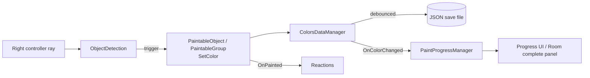

# Color Room VR

A cozy VR room to paint. Point at any object with your right controller, pick a color from the palette and pull the trigger to paint it. Paint everything to complete the room. Your progress is saved between sessions, and some objects react when painted (candles, fan, cat, radio and more).

Made as a challenge to complete the [Unity VR Development pathway](https://learn.unity.com/pathway/vr-development).

## Demo video

Watch on YouTube: https://youtu.be/OSkjeYYAStE

## Controls

### VR headset

| Action | Control |
| --- | --- |
| Aim | Ray from the right controller |
| Paint the hovered object | Right trigger |
| Press UI buttons (palette, Tutorial, Restart room…) | Right trigger while pointing at the button |
| Switch the palette between your left hand and pinned in the world | Left primary button (X on Quest), or the *Pin palette to world* toggle on the palette |
| Replay the tutorial | *Tutorial* button on the palette |

### XR Device Simulator (no headset)

The scene includes the XR Device Simulator (XR Interaction Toolkit sample). Bindings come from its input actions:

| Action | Control |
| --- | --- |
| Move | `W` `A` `S` `D`, `Q` / `E` for down / up |
| Look around (manipulate head) | Hold right mouse button and move the mouse |
| Move the right controller | Hold `Space` and move the mouse |
| Move the left controller | Hold `Left Shift` and move the mouse |
| Trigger (paint, press UI) | Left mouse button |
| Primary button (toggle palette mode) | `B`, while manipulating the left controller |
| Grip / Secondary button / Menu | `G` / `N` / `M` |
| Cycle devices | `Tab` |
| Toggle manipulate right / left / body | `Y` / `T` / `U` |
| Reset simulated devices | `V` |
| Stop manipulation | `Esc` |
| Toggle cursor lock | `\` |

## Requirements

- Unity **6000.3.17f1**
- Universal Render Pipeline 17.3
- OpenXR (any OpenXR headset), or the XR Device Simulator
- Target platform: PC (Windows). Performance on Quest 3 is the long-term goal and has not been validated on a device yet.

## How to try it

1. Open the project in Unity 6000.3.17f1.
2. Open the scene `Assets/Scenes/Color Room.unity`.
3. Press Play. Without a headset, use the XR Device Simulator controls above.

Progress is saved as JSON in `Application.persistentDataPath/ColorsRoom_{roomID}` (`roomID` is set on the `ColorsDataManager` in the scene). To start over, click the **Restart room** button on the room-complete panel, or delete that file. The tutorial only shows the first time; replay it with the *Tutorial* button.

## Packages

### Unity packages

- [XR Interaction Toolkit](https://docs.unity3d.com/Packages/com.unity.xr.interaction.toolkit@3.3/manual/index.html) 3.3.1
- [OpenXR Plugin](https://docs.unity3d.com/Packages/com.unity.xr.openxr@1.16/manual/index.html) 1.16.1
- [XR Plugin Management](https://docs.unity3d.com/Packages/com.unity.xr.management@4.5/manual/index.html) 4.5.4
- [Universal Render Pipeline](https://docs.unity3d.com/Packages/com.unity.render-pipelines.universal@17.3/manual/index.html) 17.3.0

### Third-party

- [EditorAttributes](https://github.com/v0lt13/EditorAttributes) (git package)
- [Quick Outline](https://github.com/chrisnolet/QuickOutline) (bundled in `Assets/QuickOutline`)
- [AnotherColorPicker](https://github.com/Dandarawy/ACP) (bundled in `Assets/AnotherColorPicker`)
- [DOTween](https://dotween.demigiant.com/) 1.2.815 (bundled in `Assets/Plugins/Demigiant`)

## Architecture

All game code lives in `Assets/Scripts` under the `ColorRoomVR` namespace, split by role:

| Folder | Responsibility |
| --- | --- |
| `Coloring/` | `PaintableObject` (one mesh) and `PaintableGroup` (several objects painted together). Colors are applied with a `MaterialPropertyBlock` on `_BaseColor`, so shared materials are never modified. |
| `Data/` | `ColorsDataManager` keeps an `id -> Color` dictionary and saves it (debounced) through `IColorPersistenceService`. The default implementation writes JSON to `Application.persistentDataPath`. |
| `Interaction/` | `ObjectDetection` raycasts from the right controller, outlines the hovered object and paints it on trigger. `PaletteAnchor` keeps the palette on the left hand or pinned in the world. `PaintVFXManager` plays paint effects. |
| `Progress/` | `PaintProgressManager` counts paintable units (a group counts as one) and raises events when progress changes or the room is completed. |
| `UI/` | Progress counter, room-complete panel with confetti, first-run tutorial and world-space panel placement. |
| `Reactions/` | Components such as `AnimationOnPaint` and `EnableOnPaint`, wired to `PaintableObject.OnPainted` to animate or unlock things in the room. |

### Paint flow

Design notes:

- **Persistence is swappable.** `ColorsDataManager` only talks to `IColorPersistenceService`, so the JSON file backend can be replaced without touching the painting code.
- **Progress comes from the save data.** An object counts as painted when its id has a saved color, so progress and reactions are restored automatically when the scene loads.
- **Stable ids.** Each paintable (or group) has an id used as its save key; renaming it orphans its saved color.

## Design document

The original design document, updated to match the final project: [Color Room VR Project Design Doc (PDF)](docs/Color%20Room%20VR%20Project%20Design%20Doc.pdf).

## Credits and license

- Models, sounds, music and AI-generated images: see [`CREDITS.md`](CREDITS.md).
- The project is released under the MIT license: see [`LICENSE`](LICENSE).
